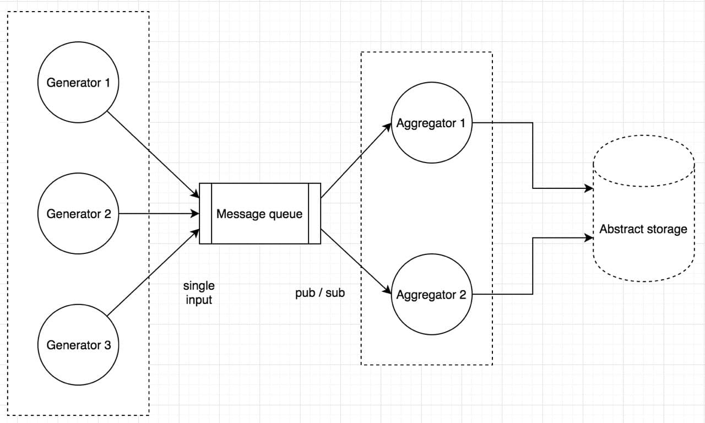

# Input config

```
{
    "generators": [
        {
            "timeout_s":                30,         // generator stop timeout in seconds
            "send_period_s":            1,          // data send period in seconds
            "data_sources": [
                {
                    "id":               "data_1",   // data source identificator (dataId)
                    "init_value":       50,         // start value
                    "max_change_step":  5,          // maximum change step for previous value
                },
                ...
            ],
        },
        ...
    ],
    "agregators": [
        {
            "sub_ids":                  ["data_1],  // array of dataIds that agregator subscribes to
            "agregate_period_s":        10          // period in seconds to collect and process data
        }
    ],
    "queue": {
        "size":                         50,         // message queue size
    },
    "storage_type":                     0           // 0 - console, 1 - file with some name
}
```

# Description

## Generator

Starts and produces data for specified period of time (`timeout_s`).
Every generator might produce several data sources (dataIds).
For every data source, value changes in time starting with initial point (`init_value`) and increases randomly with max step (`max_change_step`).

## Message queue

Basic FIFO buffer with single input and multiple output.
Queue output should be implemented as pub / sub broker.
Once all generators are stopped, queue must be notified about that event in order to notify all output listeners.

## Aggregator

Starts and aggregates data while input channel is "alive".
Aggregation processing:

- collect all incoming data for specified period of time (`agregate_period_s`);
- calculate average value for every dataId;
- send average values to Storage;
- start new aggregation iteration;
  Sending data to Storage should be asynchronous.

## Data format

{
"id": "data_1",
"value": 50
}

## Abstract storage

Unified interface to store integer value with corresponding name (id).
Every value added to the Storage is a new line (new entry), so no aggregation here.
Storage type is specified in config file.

# Requirements

- only Golang standard libraries. App could be written with the help of Cobra framework. No queue brokers;
- application should react to SIGINT UNIX signal and stop all workers gracefully;
- application should be packed into docker container;
- application should not require any preparation steps, but run docker container, with some parameters if needed;
- application should have short Readme with application running instructions.
